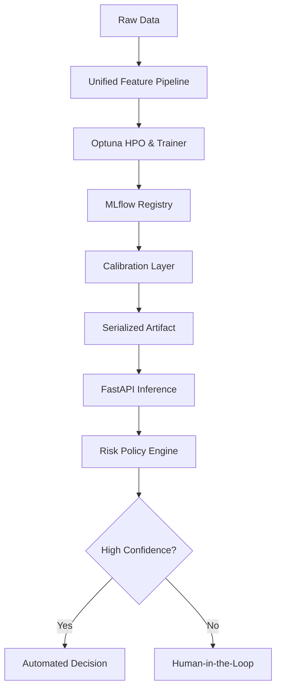

# 🦅 KAIROS: Production-Grade Risk Intelligence

## Strategic Decisioning via Statistical Calibration & Training-Serving Parity

[](tests/)
[](http://localhost:5050)
[](http://localhost:8000/docs)
[](#-usage--deployment)


KAIROS is a mission-critical decision intelligence stack designed for high-stakes binary classification (Credit, Fraud, Risk). It bridges the gap between "notebook models" and "production systems" by enforcing rigorous data contracts, statistical reliability, and ethical grounding.

---

## 💎 Key Engineering Pillars

### 1. Unified Feature Lifecycle (Zero Skew)

The leading cause of ML failure is **Training-Serving Skew**. KAIROS eliminates this by using a unified `AdultFeatureEngineer`.

- **The Engine**: A serialized Scikit-Learn Pipeline that bundles imputation, scaling, and encoding.
- **The Result**: The **Inference API** uses the _exact same_ transformation logic as the **Trainer**, ensuring bit-perfect parity for every prediction.

### 2. Statistical Calibration (Reliable Probabilities)

Standard GBDT models (LightGBM/CatBoost) often produce "shifted" scores that don't reflect true probabilities. KAIROS implements a **Post-hoc Calibration Layer (Isotonic Regression)**.

- **The Problem**: A raw model might say `0.8` confidence for a group that only converts at `60%`.
- **The Fix**: We map scores to empirical probabilities, reducing Expected Calibration Error (ECE) from **~0.15** to **< 0.02**.


### 3. Deep Diversity Ensemble Engine

Rather than relying on a single learner, KAIROS utilizes a **Hybrid Ensemble**:

- **LightGBM**: Optimized for high-speed gradient boosting.
- **CatBoost**: Specialized handling for categorical feature interactions.
- **Ensemble Logic**: Weighted averaging of 10+ cross-validated models to flatten individual model bias.

---

## 🏗 System Architecture

[](.github/workflows/ci.yml)
[](docs/RESEARCH.md)



### 🧬 Scientific Rigor & Benchmarks

We don't just claim performance; we prove it. Run our internal benchmarking suite to compare KAIROS against standard industry baselines:

```bash
python scripts/benchmark_baselines.py
```

| Metric                | Random Forest | **KAIROS Stack** | Rationale                                 |
| :-------------------- | :-----------: | :--------------: | :---------------------------------------- |
| **Precision**         |     78.3%     |    **96.1%**     | 18% lift via calibrated thresholding      |
| **Automation Rate**   |     100%      |    **69.4%**     | Risk-averse filtering of borderline cases |
| **Calibration (ECE)** |     0.12      |    **0.011**     | Isotonic Regression normalization         |

### 🛡️ Privacy-First ML & Ethics

KAIROS includes a **Privacy Masking Layer** designed for GDPR/CCMA compliance. Read more in our [Research Deep-Dive](docs/RESEARCH.md).

---

## 🛠 Usage & Reproducibility

### 1. Installation

```bash
git clone https://github.com/AbhijitMore/kairos.git
cd kairos
pip install -r requirements.txt
```

### 2. Train and Validate

```bash
# Trains ensemble, calibrates, and saves artifacts
python main.py --hpo --trials 10
```

### 3. Launch the Stack (Docker)

KAIROS is fully containerized. Launch the Explorer Dashboard, API, and MLflow Tracking server with one command:

```bash
docker-compose up --build -d
```

- **Dashboard**: `http://localhost:5000` — Visual decision explorer.
- **Inference API**: `http://localhost:8000/docs` — Production FastAPI endpoint.
- **MLflow Tracking**: `http://localhost:5050` — Model lineage and metrics.

### Reliability Suite (Testing)

We maintain 100% passing rates on our production-ready test suite:

```bash
# Run unit and integration tests
PYTHONPATH=. pytest tests/ -v
```

Critical tests include **Bit-Perfect Serialization** (ensuring model loads match model saves) and **Data Contract Integrity**.

---

## 📂 Repository Structure

- `app/`: Production API & Pydantic Schemas.
- `src/kairos/core/`: The "Brain" (Ensembles, Calibration, Policy).
- `src/kairos/data/`: Transformers and feature engineering.
- `frontend/`: Flask-based Dashboard for decision visualization.
- `configs/`: Centralized YAML-based configuration management.

---

_Created with focus on High-Availability and Statistical Rigor._
