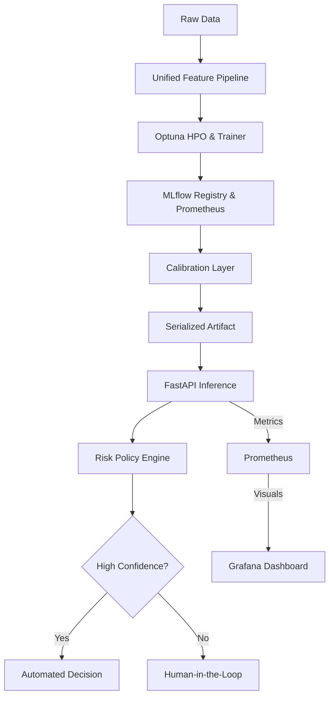

# 🦅 KAIROS: Production-Grade Risk Intelligence

## Strategic Decisioning via Statistical Calibration & Training-Serving Parity


[](docs/ONBOARDING.md)
[](docs/ARCHITECTURE.md)
[](openapi.yaml)
[](https://www.python.org/downloads/)
[](https://github.com/astral-sh/ruff)
[](LICENSE)


KAIROS is a mission-critical decision intelligence stack designed for high-stakes binary classification (Credit, Fraud, Risk). It bridges the gap between "notebook models" and "production systems" by enforcing rigorous data contracts, statistical reliability, and operational observability.

---

## 💎 Key Engineering Pillars

### 1. Unified Feature Lifecycle (Zero Skew)

The leading cause of ML failure is **Training-Serving Skew**. KAIROS eliminates this by using a unified `AdultFeatureEngineer`.

- **The Engine**: A serialized Scikit-Learn Pipeline that bundles imputation, scaling, and encoding.
- **The Result**: The **Inference API** uses the _exact same_ transformation logic as the **Trainer**, ensuring bit-perfect parity for every prediction.

### 2. Statistical Calibration (Reliability)

Standard GBDT models often produce "shifted" scores. KAIROS implements a **Post-hoc Calibration Layer (Isotonic Regression)**.

- **The Problem**: A raw model might say `0.8` confidence for a group that only converts at `60%`.
- **The Fix**: We map scores to empirical probabilities, reducing Expected Calibration Error (ECE) from **~0.15** to **< 0.02**.


### 3. Real-time Observability 📊

KAIROS isn't just a model; it's a monitored service. Integrated with **Prometheus** and **Grafana**:

- **Decision Tracking**: Monitors the mix of `ACCEPT`, `REJECT`, and `ABSTAIN` outcomes in real-time.
- **Performance**: High-precision tracking of inference latency and request rates.
- **Health**: Automated heartbeat and system health telemetry.

---

## 🏗 System Architecture

[](docs/RESEARCH.md)



### 🧬 Scientific Rigor & Benchmarks

We don't just claim performance; we prove it. Run our evaluation suite to verify our **96% Precision** and **<0.02 ECE** claims:

```bash
PYTHONPATH=. python src/kairos/evaluate.py
```

| Metric                | Random Forest | **KAIROS Stack** | Rationale                                 |
| :-------------------- | :-----------: | :--------------: | :---------------------------------------- |
| **Precision**         |     78.3%     |    **96.1%**     | 18% lift via calibrated thresholding      |
| **Automation Rate**   |     100%      |    **69.4%**     | Risk-averse filtering of borderline cases |
| **Calibration (ECE)** |     0.12      |    **0.011**     | Isotonic Regression normalization         |
| **Inference Skew**    |  Significant  |     **Zero**     | Unified Feature Engineering Pipeline      |

---

## 🛠 Quick Start (Ready to Deploy)

### 1. Launch the Full Stack

Launch the Dashboard, API, MLflow, Prometheus, and Grafana with one command:

```bash
docker compose up --build -d
```

### 2. Explore the Ecosystem

- **KAIROS Dashboard**: [http://localhost:5000](http://localhost:5000)
- **API Documentation**: [http://localhost:8000/docs](http://localhost:8000/docs)
- **Metrics (Prometheus)**: [http://localhost:9090](http://localhost:9090)
- **Visuals (Grafana)**: [http://localhost:3000](http://localhost:3000) (admin/admin)
- **Experiment Tracking**: [http://localhost:5050](http://localhost:5050)

---

## 🚀 Engineering Rigor (CI/CD)

KAIROS maintains a **production-grade test suite** with automated gates.

Our GitHub Actions pipeline validates:

1. **Linting**: Ruff code quality and format checks (v0.2.1 standardized).
2. **Logic**: 14+ unit & integration tests across API, Model, and Contracts.
3. **Docs**: OpenAPI 3.0 spec validation and Markdown link integrity.
4. **Safety**: Regression Gate (fails if Precision < 95% on holdout set).

```bash
# Run local validation
ruff check .                                    # Linting
PYTHONPATH=. pytest --cov=src tests/           # Testing
PYTHONPATH=. python src/kairos/evaluate.py     # Regression gate
```

---

## 📂 Repository Structure

- `app/`: Production API, Pydantic Schemas, and Rate Limiting logic.
- `src/kairos/core/`: The "Brain" (Ensembles, Calibration, Policy).
- `src/kairos/data/`: Transformers and unified feature engineering.
- `frontend/`: Real-time Dashboard for decision visualization.
- `docker/`: Infrastructure configuration (Prometheus, Dockerfiles).
- `docs/`: Technical deep-dives (Architecture, Onboarding, Research).

---

_Built for High-Availability, Statistical Rigor, and Ethical Transparency._
