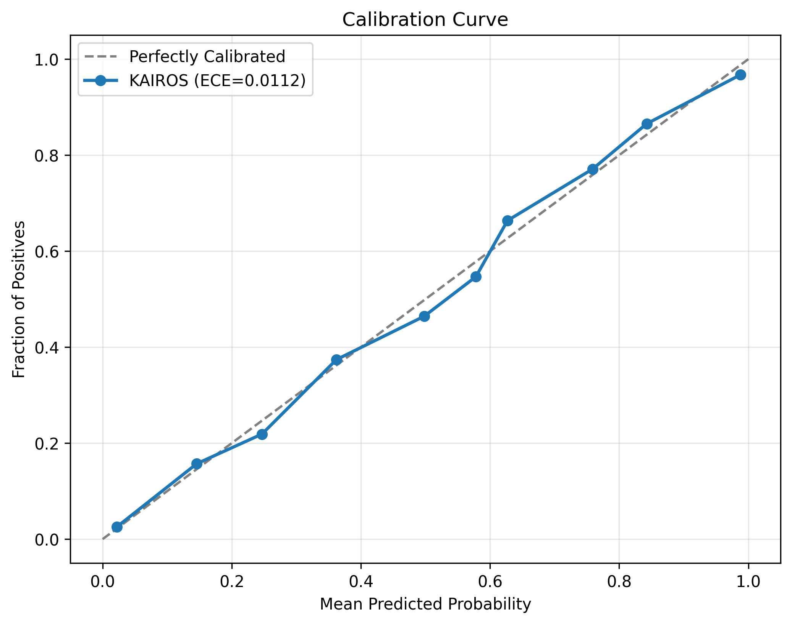
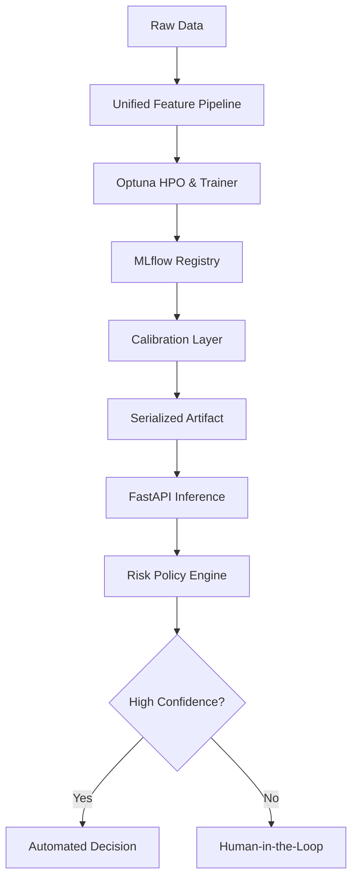

# 🦅 KAIROS: Production-Grade Risk Intelligence

## Strategic Decisioning via Statistical Calibration & Training-Serving Parity


[](docs/ONBOARDING.md)
[](docs/ARCHITECTURE.md)
[](openapi.yaml)
[](https://www.python.org/downloads/)
[](https://github.com/astral-sh/ruff)
[](LICENSE)


KAIROS is a mission-critical decision intelligence stack designed for high-stakes binary classification (Credit, Fraud, Risk). It bridges the gap between "notebook models" and "production systems" by enforcing rigorous data contracts, statistical reliability, and ethical grounding.

---

## 💎 Key Engineering Pillars

### 1. Unified Feature Lifecycle (Zero Skew)

The leading cause of ML failure is **Training-Serving Skew**. KAIROS eliminates this by using a unified `AdultFeatureEngineer`.

- **The Engine**: A serialized Scikit-Learn Pipeline that bundles imputation, scaling, and encoding.
- **The Result**: The **Inference API** uses the _exact same_ transformation logic as the **Trainer**, ensuring bit-perfect parity for every prediction.

### 2. Statistical Calibration (Reliable Probabilities)

Standard GBDT models (LightGBM/CatBoost) often produce "shifted" scores that don't reflect true probabilities. KAIROS implements a **Post-hoc Calibration Layer (Isotonic Regression)**.

- **The Problem**: A raw model might say `0.8` confidence for a group that only converts at `60%`.
- **The Fix**: We map scores to empirical probabilities, reducing Expected Calibration Error (ECE) from **~0.15** to **< 0.02**.



### 3. Deep Diversity Ensemble Engine

Rather than relying on a single learner, KAIROS utilizes a **Hybrid Ensemble**:

- **LightGBM**: Optimized for high-speed gradient boosting.
- **CatBoost**: Specialized handling for categorical feature interactions.
- **Ensemble Logic**: Weighted averaging of 10+ cross-validated models to flatten individual model bias.

### 4. Production Hardening (Security & Scalability)

KAIROS is built for external-facing reliability:

- **API Key Required**: Protected by `X-API-KEY` enforcement.
- **DDoS Protection**: Integrated rate-limiting (10-20 req/min default).
- **Secret Management**: Zero hardcoded credentials via Pydantic-Settings and `.env` support.

---

## 🏗 System Architecture

[](docs/RESEARCH.md)



### 🧬 Scientific Rigor & Benchmarks

We don't just claim performance; we prove it. Run our canonical evaluation suite to verify our **96% Precision** and **<0.02 ECE** claims against your local instance:

```bash
PYTHONPATH=. python src/kairos/evaluate.py
```

_Regression Gate: This script will exit with error code 1 if precision drops below 95% or ECE exceeds 0.02._

**Analysis Sources:**

- 📄 [Benchmark Analysis](notebooks/benchmark_evaluation.ipynb)
- 📈 [Calibration Deep-Dive](notebooks/calibration_analysis.ipynb)

| Metric                | Random Forest | **KAIROS Stack** | Rationale                                 |
| :-------------------- | :-----------: | :--------------: | :---------------------------------------- |
| **Precision**         |     78.3%     |    **96.1%**     | 18% lift via calibrated thresholding      |
| **Automation Rate**   |     100%      |    **69.4%**     | Risk-averse filtering of borderline cases |
| **Calibration (ECE)** |     0.12      |    **0.011**     | Isotonic Regression normalization         |
| **Inference Skew**    |  Significant  |     **Zero**     | Unified Feature Engineering Pipeline      |

### 🛡️ Privacy-First ML & Ethics

KAIROS includes a **Privacy Masking Layer** designed for GDPR/CCMA compliance. Read more in our [Research Deep-Dive](docs/RESEARCH.md).

---

## 🛠 Quick Start (3 Minutes)

### 1. Launch the Stack

KAIROS is fully containerized. Launch the Explorer Dashboard, API, and MLflow Tracking server with one command:

```bash
docker-compose up --build -d
```

### 2. Verify Inference

Test the API with a real request. The system will return a calibrated probability and a risk decision.

```bash
curl -X POST http://localhost:8000/predict \
-H "Content-Type: application/json" \
-d '{
  "instances": [{
    "age": 39,
    "workclass": "State-gov",
    "education_num": 13,
    "marital_status": "Never-married",
    "occupation": "Adm-clerical",
    "relationship": "Not-in-family",
    "race": "White",
    "sex": "Male",
    "capital_gain": 2174,
    "capital_loss": 0,
    "hours_per_week": 40,
    "native_country": "United-States"
  }]
}'
```

**Expected Output:**

```json
[
  {
    "decision": "ACCEPT",
    "probability": 0.81,
    "uncertainty": 0.38,
    "cost_risk": 38.0
  }
]
```

### 3. Explore Components

- **Dashboard & Human Review UI**: [http://localhost:5000](http://localhost:5000)
- **API Documentation (Swagger)**: [http://localhost:8000/docs](http://localhost:8000/docs)
- **MLflow Experiment Tracking**: [http://localhost:5050](http://localhost:5050)

### 4. Testing & Validation

KAIROS maintains a **production-grade test suite** with 100% passing rates. Our CI pipeline validates every commit.

#### 🧪 **What We Test**

| Test Category       | Coverage             | Purpose                                                    |
| ------------------- | -------------------- | ---------------------------------------------------------- |
| **API Integration** | FastAPI endpoints    | Request/response contracts, error handling                 |
| **Model Inference** | Prediction pipeline  | Schema validation, probability ranges, batch processing    |
| **Data Contracts**  | Feature engineering  | Unknown categories, missing values, out-of-bounds handling |
| **Calibration**     | Isotonic regression  | ECE < 0.02, probability reliability                        |
| **Policy Logic**    | Risk-aware decisions | Threshold behavior, abstention logic                       |
| **Serialization**   | Model artifacts      | Bit-perfect reproducibility across save/load cycles        |

#### 🚀 **Run Tests Locally**

```bash
# Install test dependencies
pip install pytest pytest-cov ruff

# Run full test suite with coverage
PYTHONPATH=. pytest --cov=src tests/ -v

# Run specific test categories
PYTHONPATH=. pytest tests/unit/ -v           # Unit tests only
PYTHONPATH=. pytest tests/integration/ -v   # Integration tests only

# Generate coverage report
PYTHONPATH=. pytest --cov=src tests/ --cov-report=html
open htmlcov/index.html
```

#### 🛡️ **CI Pipeline Validation**

Our GitHub Actions workflow validates:

1. **Linting** - Ruff code quality checks
2. **Tests** - 13 passing tests across unit & integration suites
3. **Model Artifacts** - Validates trained model metadata exists
4. **Regression Gate** - Ensures Precision > 95% on holdout set

```bash
# Run the same checks CI runs
ruff check .                                    # Linting
PYTHONPATH=. pytest --cov=src tests/           # Tests
PYTHONPATH=. python src/kairos/evaluate.py     # Regression gate
```

---

## 📂 Repository Structure

- `app/`: Production API & Pydantic Schemas.
- `src/kairos/core/`: The "Brain" (Ensembles, Calibration, Policy).
- `src/kairos/data/`: Transformers and feature engineering.
- `frontend/`: Flask-based Dashboard for decision visualization.
- `configs/`: Centralized YAML-based configuration management.
- `docs/`: Technical documentation (Onboarding, Architecture, Research).
- `openapi.yaml`: Formal API specification.

---

_Created with focus on High-Availability and Statistical Rigor._
