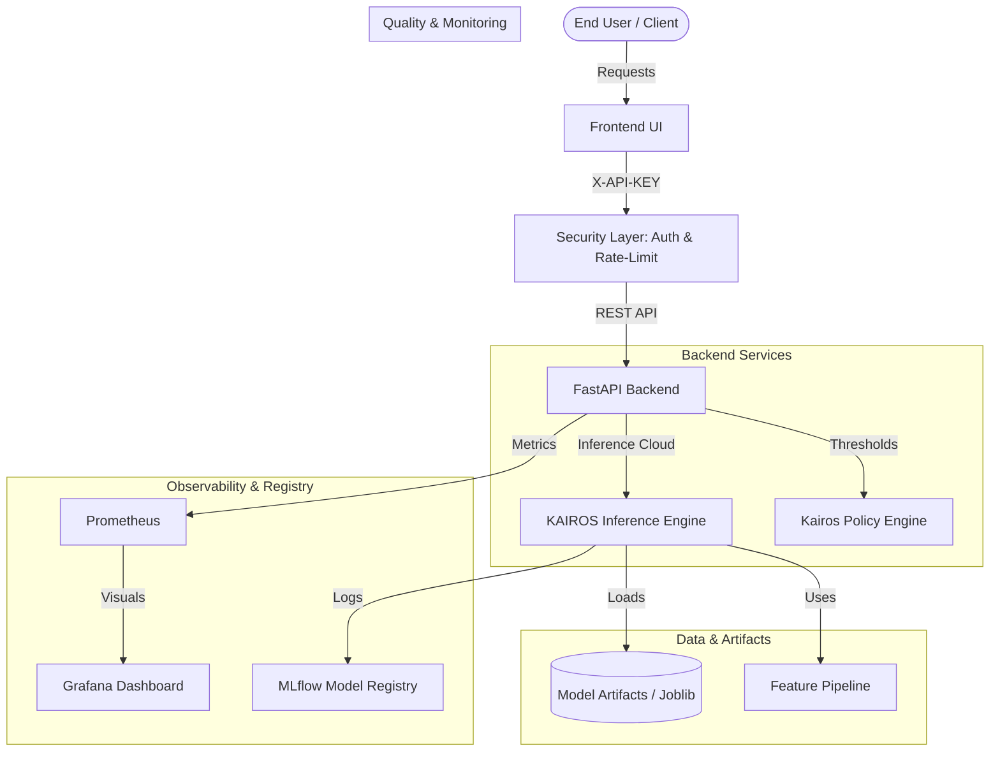

# System Architecture

This document outlines the high-level architecture of **KAIROS**, detailing the flow of data from ingestion through inference to the final decision policy.

---

## 1. High-Level System Overview

KAIROS is designed as a modular decision-intelligence service. It decouples the core ML inference engine from the business policy layer, allowing for independent scaling and policy updates.



---

## 2. Component Breakdown

### A. Frontend (React / Static Assets)

- Built for precision visualization of risk metrics.
- Communicates with the backend via asynchronous `fetch` calls.
- Handles uncertainty visualization (confidence intervals).

### B. FastAPI Backend

- Acts as the orchestration layer.
- **Lifespan Management:** Loads the ML engine into memory at startup.
- **Sanitization:** Cleans data (handling `NaNs`, type enforcement) before passing to the engine.

### C. KAIROS Inference Engine

- Encapsulates the `CatBoost` (or similar) classifier.
- **Pipeline:** Applies pre-fitted scalers, encoders, and feature transformations.
- **Calibration:** Outputs calibrated probabilities rather than raw scores.

### D. Kairos Policy Engine

- A decoupled logic block that takes probabilities and applies decision thresholds (`tau_low`, `tau_high`).
- Outputs discrete verdicts: `ACCEPT`, `REJECT`, or `ABSTAIN`.

---

## 3. Data Flow (Prediction Cycle)

1. **Ingestion:** API receives a batch of raw JSON instances.
2. **Pre-processing:** `AdultInstance` schemas validate field types.
3. **Pipeline Transformation:** Features are mapped to the high-dimensional vector space expected by the model.
4. **Scoring:** The ensemble model performs probabilistic inference.
5. **Decisioning:** The policy engine maps probabilities to business outcomes.
6. **Delivery:** JSON response returns the verdict, probability, uncertainty, and cost-risk index.

---

## 🧠 Model Strategy: The 10-Model Hybrid Ensemble

KAIROS achieves state-of-the-art predictive stability by utilizing a **Hybrid Ensemble** architecture:

- **Architecture Diversity**: We combine **LightGBM** (leaf-wise GBDT) with **CatBoost** (symmetric-tree GBDT). This ensures the engine captures both complex feature interactions and robust categorical patterns.
- **Fold Diversity**: We utilize **5-Fold Stratified Cross-Validation**.
- ** Consensus Logic**: 5 Folds × 2 Architectures = **10 Independent Models**. The final inference is a weighted consensus of all 10 artifacts, drastically reducing individual model variance and overfitting.

---

## 🚀 Deployment Topology

The system is fully containerized using Docker, making it cloud-agnostic and reproducible.

```mermaid
deployment
    node "Docker Host" {
        container "frontend:latest" as UI
        container "backend:latest" as API
        volume "model_artifacts" as VM
    }

    API -- mounts --> VM
    UI -- talks to :8000 --> API
```
